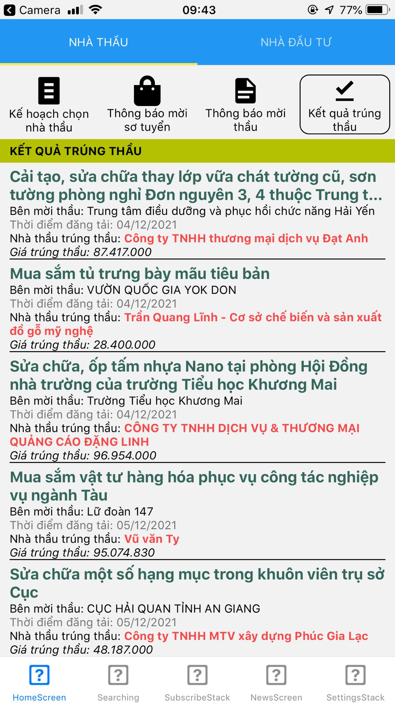
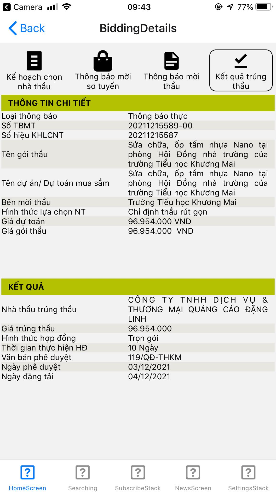
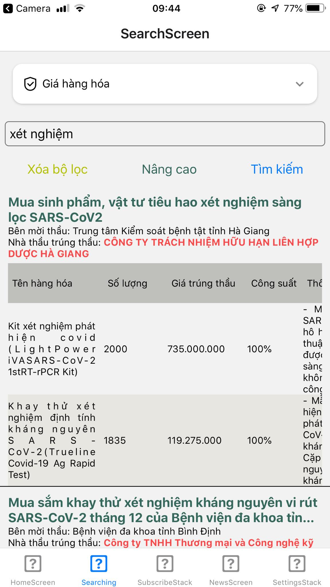
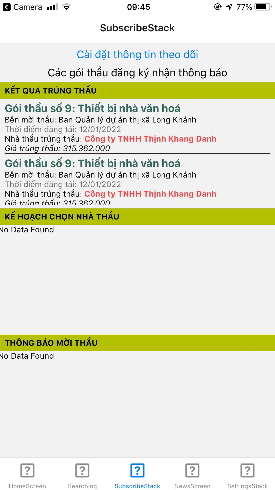
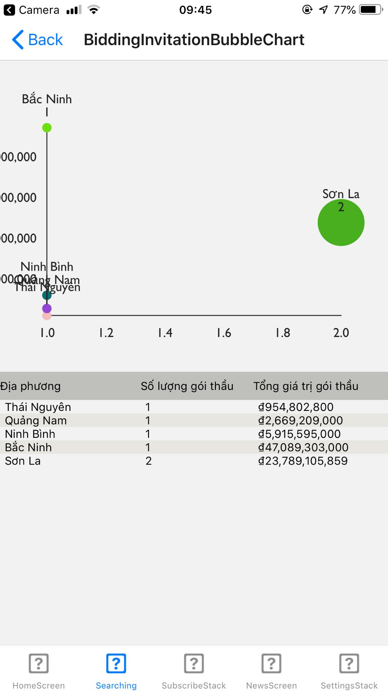
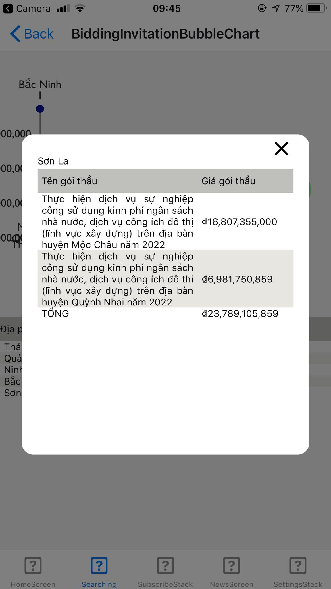

# React Native app for searching, receiving bidding information from [muasamcong website](http://muasamcong.mpi.gov.vn/)

## Screenshots

Home Screen

  

Bid details

  

Search

  

Subscribe

  

Bubble chart

  

  

## Setup
1. Clone this repository
> `git clone https://github.com/dinhhh/dauthaubk-frontend`
1. Clone and run [this repository](https://github.com/dinhhh/dauthaubk-server) for server
2. Install dependency
> `npm install --global expo-cli`
> 
> `npm install`
4. Run by expo
> `expo start`

## API path is defined [here](config/Api.js)
